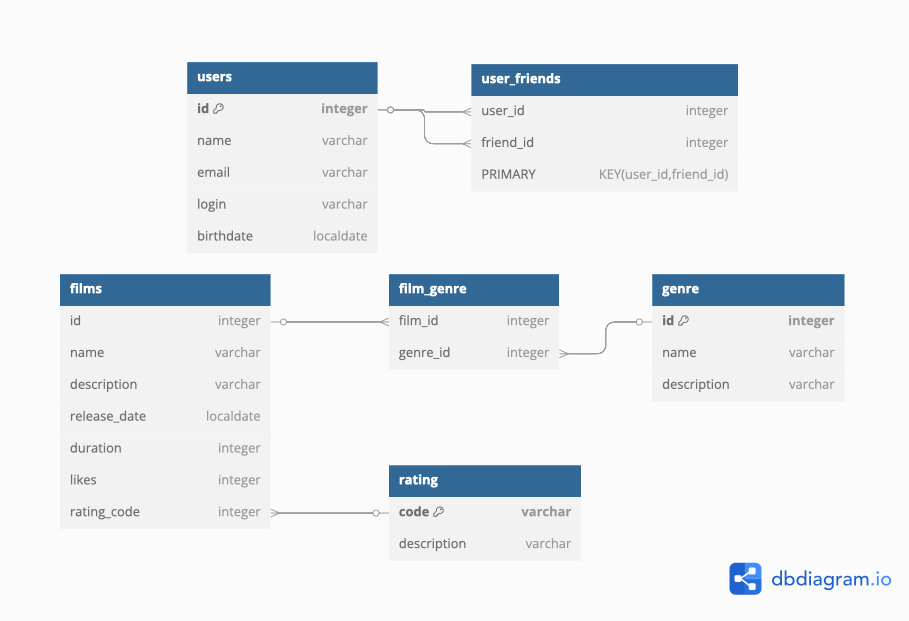

# filmorate
## Схема базы данных <br>

- Фильмы -> films <br>
- Жанры -> genre <br>
- Рейтинг -> rating <br>
- Связь фильма с жанрами -> film_genre <br>
- Пользователи -> users <br>
- Список друзей -> user_friends <br>


```markdown Пример запроса на выборку:
```sql SELECT * FROM users WHERE id = 1;
`` Запрос выбирает все данные о пользователе с id = 1`.

```sql SELECT * FROM films WHERE id = 1;
`` Запрос выбирает все данные о фильме с id = 1`.

```sql SELECT * FROM genre;
`` Запрос выбирает все возможные жанры`.

```sql SELECT * FROM rating;
`` Запрос выбирает все возможные значения рейтингов`.
