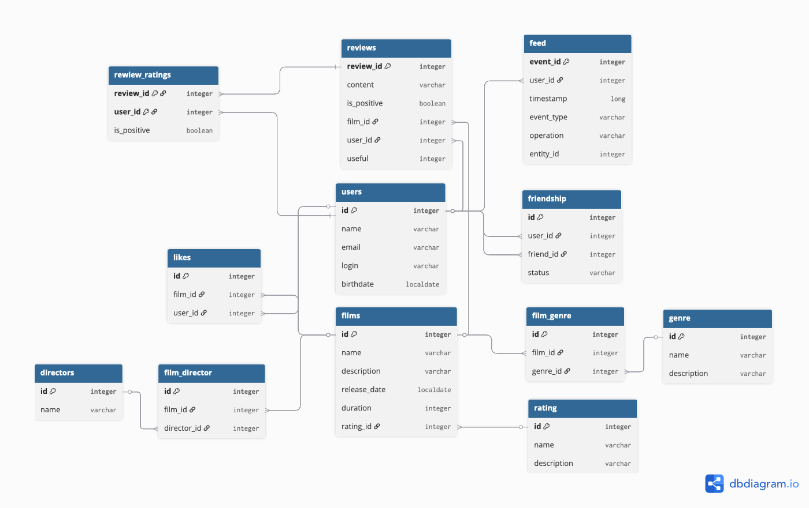

# filmorate
## Схема базы данных <br>

- Фильмы -> films <br>
- Жанры -> genre <br>
- Рейтинг -> rating <br>
- Связь фильма с жанрами -> film_genre <br>
- Пользователи -> users <br>
- Список друзей -> user_friends <br>
- Список лайков -> likes <br>
- Режиссеры -> directors
- Связь фильма с режиссерами -> film_director
- Отзывы -> reviews
- Рейтинг отзыва -> review_ratings
- Лента событий -> feed


```sql 
SELECT * FROM users WHERE id = 1;
```
Запрос выбирает все данные о пользователе с id = 1.
```sql
SELECT * FROM films WHERE id = 1;
```
Запрос выбирает все данные о фильме с id = 1.
```sql 
SELECT * FROM genre;
```
Запрос выбирает все возможные жанры.

```sql 
SELECT * FROM rating;
```
Запрос выбирает все возможные значения рейтингов`.

## Реализация функциональности <br>

| Автор             | Функциональность                                       | Ссылка на GitHub                 |
|:------------------|:-------------------------------------------------------|:---------------------------------|
| Евгения Годына    | - Фильмы по режиссерам <br> - Поиск                    | https://github.com/GodynaEvgenia |
| Владимир Васильев | - Отзывы <br> - Лента событий                          | https://github.com/walder86      |
| Иван Батуро       | - Рекомендации <br> - Удаление фильмов и пользователей | https://github.com/IvanB823      |
| Сергей Петров     | - Общие фильмы <br> - Популярные фильмы                | https://github.com/sergio2308    |